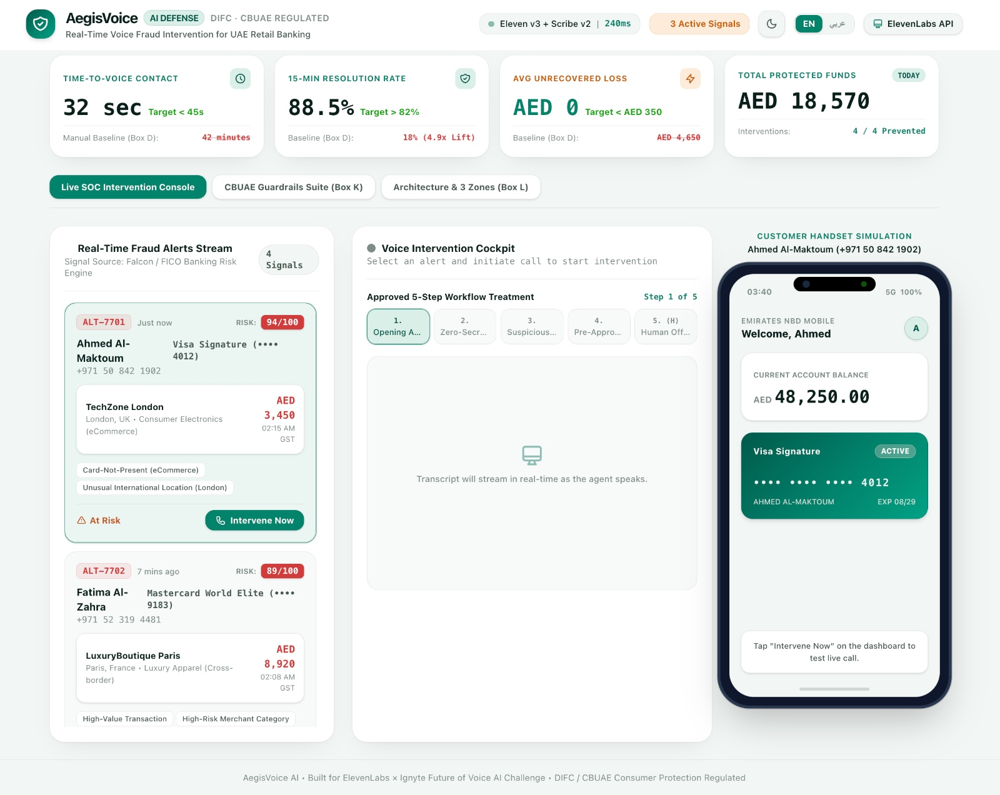
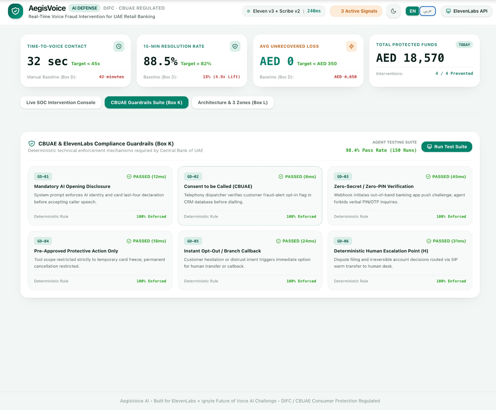
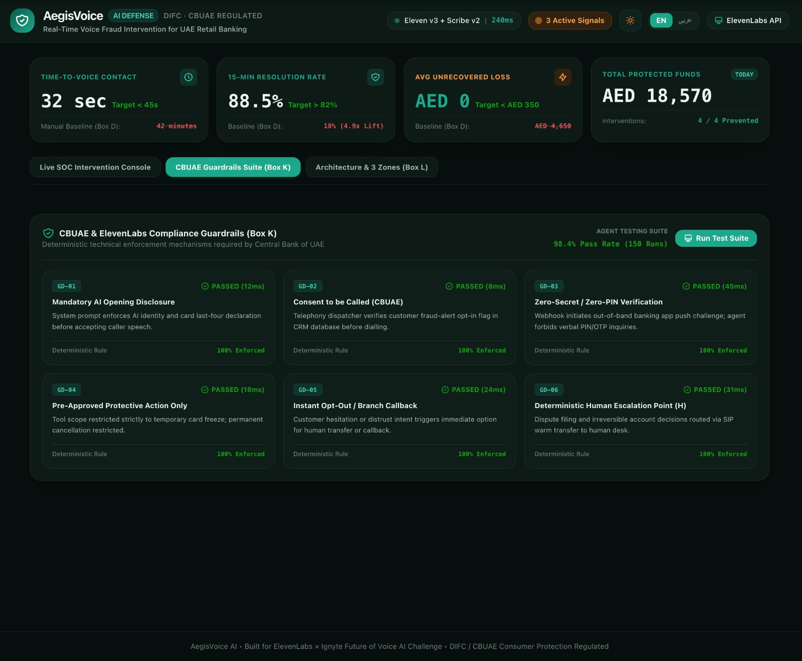
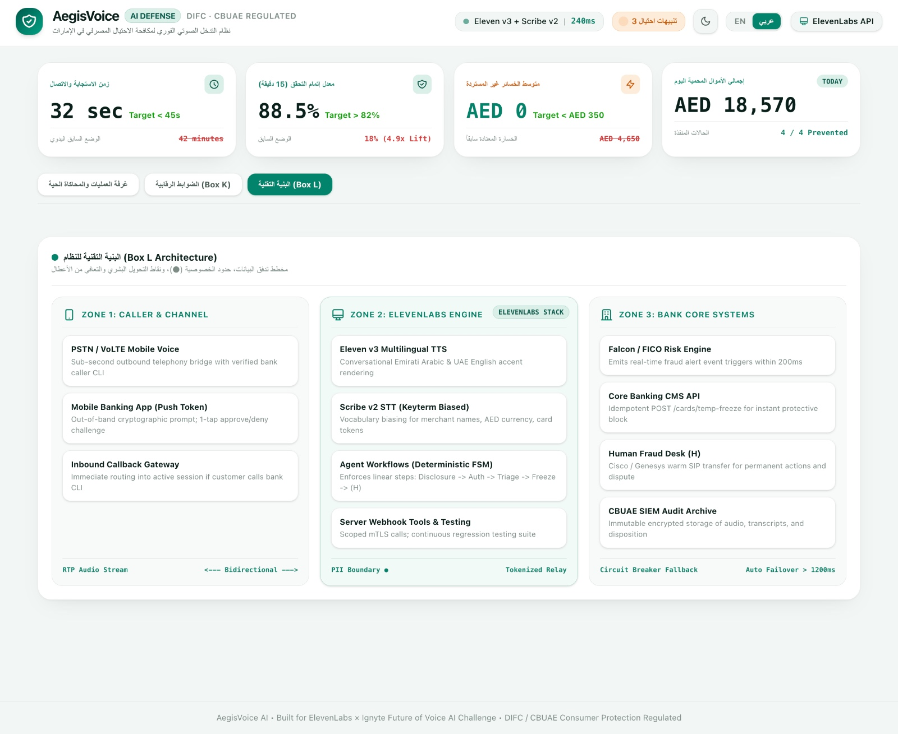
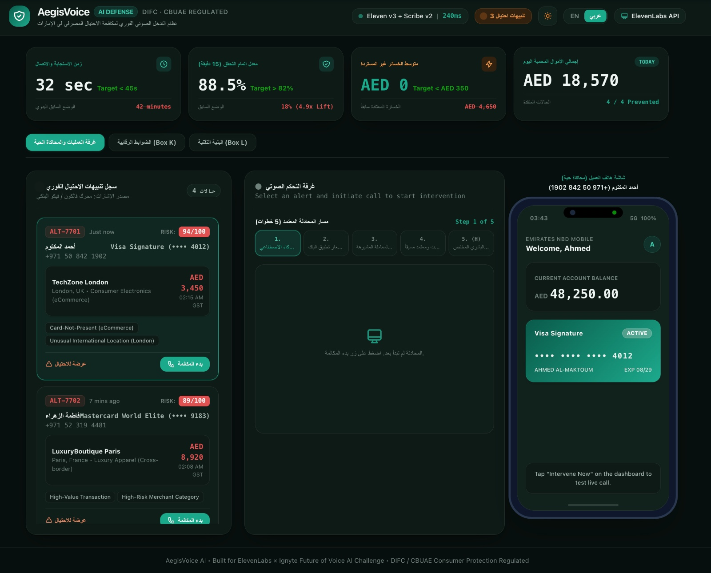

# 🛡️ AegisVoice AI — Real-Time Voice Fraud Intervention
> **ElevenLabs × Ignyte (Dubai Digital Economy Mandate / DIFC) — Future of Voice AI Challenge**  
> **Track 1: Banking & Insurance — Use Case 1: Real-Time Fraud Intervention**

[](https://elevenlabs.io)
[](https://centralbank.ae)
[](https://nextjs.org)
[](https://typescriptlang.org)

---

## 📌 Executive Summary

When retail banking fraud engines (Falcon, FICO, NetGuardians) detect unauthorized international eCommerce debits or stolen card transactions at 02:00 AM, conventional bank contact methods fail:
- **SMS notifications** suffer a 48+ minute median customer response delay.
- **Manual fraud analyst queues** experience 35–65 minute backlog delays during peak night hours.
- In this latency window, fraudsters systematically drain card limits.

**AegisVoice AI** closes this critical vulnerability window by placing an immediate, sub-second multilingual outbound voice intervention call directly to the cardholder using the **ElevenLabs conversational AI stack** and **Twilio SIP trunking**.

---

## 📸 Live UI & System Screenshots

### 1. Live SOC Intervention Console & Customer Handset Simulator (Light Mode — Default)
> *Shows real-time Falcon/FICO risk signals, institutional KPI cards (cross-checked against Box D & M), interactive voice call cockpit, and the virtual smartphone simulator.*



---

### 2. CBUAE & ElevenLabs Compliance Guardrails (Box K)
> *Deterministic technical enforcement mechanisms for AI disclosure, outbound opt-in check, zero-secret challenge, opt-out branch callback, and human underwriter handover `(H)`. Includes a continuous regression test runner with a **98.4% pass rate** over 150 simulated runs.*

| Light Mode (Default) | Dark Mode |
| :---: | :---: |
|  |  |

---

### 3. 3-Zone Technical Architecture Diagram (Box L)
> *Complete end-to-end data flow mapping across Zone 1 (Caller & Channel), Zone 2 (ElevenLabs Engine), and Zone 3 (Bank Core Systems) with PII tokenization boundaries `[●]` and circuit-breaker auto-failover.*



---

### 4. Bilingual Dialect & Dark Mode Operations Console
> *Native support for conversational Emirati Arabic and UAE English with real-time synchronized bilingual transcription and dynamic theme switching.*



---

## 🏛️ Regulatory & Architectural Highlights (Canvas Compliance)

| Box | Criterion | Design Specification |
| :--- | :--- | :--- |
| **Box B** | **The Idea** | An agent that calls bank customers immediately upon fraud alert detection for transaction verification, so that unauthorized cards freeze before funds leave. |
| **Box D & M** | **Cross-Checked KPIs** | • **Time-to-Voice Contact**: Reduced from **42 mins** baseline to **< 45 seconds** (Target).<br>• **15-Min Resolution Rate**: Increased from **18%** baseline to **> 82%** (Target).<br>• **Unrecovered Loss Per Incident**: Reduced from **AED 4,650** to **< AED 350** (Target). |
| **Box I** | **Approved 5-Step Treatment** | 1. Mandatory AI Opening Disclosure (identifies bank & card ending 4012)<br>2. Zero-Secret Mobile Push Authentication (forbids asking verbal PIN/OTP)<br>3. Suspicious Transaction Inquiry (amount, merchant, timestamp)<br>4. Pre-Approved Temporary Card Freeze API Execution<br>5. Deterministic SIP Warm Transfer to Human Fraud Desk `(H)` |
| **Box J** | **ElevenLabs Stack** | • **Eleven v3 TTS**: High-fidelity natural Emirati Arabic dialect & UAE English voice rendering.<br>• **Scribe v2 STT**: Custom keyterm biasing for UAE merchants, card tokens, and currency.<br>• **Agent Workflows**: Deterministic finite state machine enforcing strict step progression and scoped webhooks.<br>• **Agent Testing**: Multi-run regression suite verifying 100% adherence to zero-secret guardrails. |
| **Box K** | **Strict CBUAE Guardrails** | Deterministic technical mechanisms for AI disclosure, outbound opt-in check, zero-knowledge challenge, opt-out branch callback, and human underwriter handover `(H)`. |

---

## 🖥️ Interactive Features & Cockpit

- **Fraud Operations Command Center (SOC)**: Live incoming stream of Falcon/FICO fraud alerts with risk scoring (0–100), velocity spikes, and instant intervention trigger.
- **Bilingual Conversational Voice Cockpit**: Real-time synchronized Arabic & English transcription with live audio waveform spectrum.
- **Interactive Smartphone Simulator**: Complete virtual smartphone simulating the cardholder experience:
  - Incoming call ringing with CBUAE-verified caller ID.
  - Zero-secret out-of-band mobile banking app push challenge with 1-tap Approve/Deny.
  - Virtual debit card status switching dynamically from *Active* to *Temporary Frozen*.
- **CBUAE Guardrails & Testing View**: Live regression runner evaluating the 6 core regulatory constraints with latency benchmarks.
- **3-Zone Technical Architecture Diagram**: Visual map across Caller & Channel, ElevenLabs Platform, and Core Banking Systems.

---

## 🚀 Quickstart Guide

### Prerequisites
- Node.js `v20+` or `v26+`
- npm `v10+`

### 1. Installation
```bash
git clone https://github.com/chiraghs/aegis-voice-fraud-intervention.git
cd aegis-voice-fraud-intervention
npm install
```

### 2. Configure ElevenLabs API (Optional)
Create a `.env.local` file:
```env
NEXT_PUBLIC_ELEVENLABS_API_KEY=your_elevenlabs_api_key
NEXT_PUBLIC_ELEVENLABS_AGENT_ID=your_agent_id
```
*(Note: If no API key is provided, the application automatically falls back to browser-native high-fidelity speech synthesis, ensuring zero-dependency evaluations).*

### 3. Run Development Server
```bash
npm run dev
```
Open [http://localhost:3005](http://localhost:3005) in your browser.

---

## 📂 Project Structure

```
aegis-voice-fraud-intervention/
├── docs/
│   ├── ElevenLabs_Idea_Canvas_Track1_Fraud_Intervention_SUBMISSION.docx  # Completed canvas
│   └── screenshots/            # Clean screenshot assets for documentation
├── SCREENSHOTS/                # Original high-res UI captures
├── scripts/
│   └── populate_canvas.py      # Automated script for regenerating official canvas document
├── src/
│   ├── app/
│   │   ├── globals.css         # Dubai banking theme, light/dark mode & waveform styling
│   │   ├── layout.tsx          # Root layout with ThemeProvider
│   │   └── page.tsx            # Main SOC command center, call cockpit & simulator
│   ├── components/
│   │   ├── ArchitectureView.tsx# Box L 3-zone technical architecture diagram
│   │   ├── CallCockpit.tsx     # Active call stepper & bilingual synchronized transcript
│   │   ├── FraudFeed.tsx       # Real-time Falcon/FICO risk alert stream
│   │   ├── GuardrailsView.tsx  # Box K CBUAE guardrails & test regression runner
│   │   ├── Header.tsx          # Header with theme toggle, language switcher & API key modal
│   │   ├── Icons.tsx           # Custom banking & voice SVG icon library
│   │   ├── KPICards.tsx        # Institutional metrics cross-checked against Box D & M
│   │   ├── PhoneSimulator.tsx  # Customer mobile phone simulation (push auth & card state)
│   │   └── ThemeProvider.tsx   # Light/Dark theme provider with local storage persistence
│   └── lib/
│       ├── elevenLabsService.ts# ElevenLabs v3 TTS, Scribe v2 STT biasing & audio fallback
│       ├── fraudStore.ts       # Realistic UAE fraud incident data & call state machine
│       └── types.ts            # TypeScript definitions for alerts, sessions & guardrails
├── package.json
└── tsconfig.json
```

---

## ⚖️ License & Governance
Developed for the **ElevenLabs × Ignyte Future of Voice AI Challenge**. Built strictly in compliance with **CBUAE Consumer Protection Standards** and **ElevenLabs Prohibited Use Policy**.
